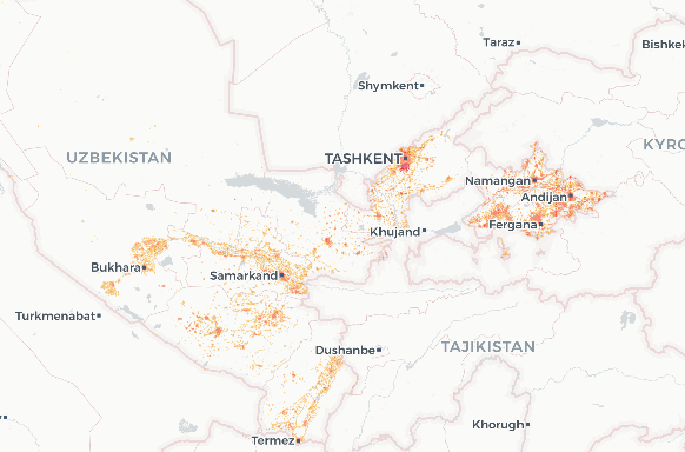

# Open Data Challenge

### Uzbekistan ###

|Region|Name | Feature Count | Format | Size (zipped) |
|-------------|------------|----------|----------|-----------|
|Uzbekistan|[**Admin boundaries with population**](https://minio-production.mapflow.ai/public/data/kontur_boundaries_UZ_20220407.gpkg.gz?Content-Disposition=attachment%3B%20filename%3D%22data%2Fkontur_boundaries_UZ_20220407.gpkg.gz)| ~138| GeoPackage | 1.3MB |
|Uzbekistan|[**Kontur population 500m**](https://minio-production.mapflow.ai/public/data/kontur_population_UZ_20220630.gpkg.gz?Content-Disposition=attachment%3B%20filename%3D%22data%2Fkontur_population_UZ_20220630.gpkg.gz)| ~108,000| GeoPackage | 6.5MB |
|Tashkent|[**Geoalert building footprints**](https://minio-production.mapflow.ai/public/data/Tashkent_buildings_Mapflow.gpkg.zip?Content-Disposition=attachment%3B%20filename%3D%22data%2FTashkent_buildings_Mapflow.gpkg.zip)| ~387,000| GeoPackage | 57MB |
|Tashkent|[**Geoalert construction detections**](https://minio-production.mapflow.ai/public/data/Tashkent_constructions_Mapflow.geojson.zip?Content-Disposition=attachment%3B%20filename%3D%22data%2FTashkent_constructions_Mapflow.geojson.zip)| ~515| GeoJSON | 114KB |
|Uzbekistan|[**Geoalert building footprints, 4 cities**](https://minio-production.mapflow.ai/public/data/4cities%28Bukhara_Samarkand_Navoi_Chirchiq%29_Mapflow.gpkg.zip?Content-Disposition=attachment%3B%20filename%3D%22data%2F4cities%28Bukhara_Samarkand_Navoi_Chirchiq%29_Mapflow.gpkg.zip)| ~301,000| GeoPackage | 31MB |
|Uzbekistan|[**MS building footprints**](https://minio-production.mapflow.ai/public/data/Uzbekistan_MS_Buildings.gpkg.zip?Content-Disposition=attachment%3B%20filename%3D%22data%2FUzbekistan_MS_Buildings.gpkg.zip)| ~6,500,000| GeoPackage | 684MB |
|Uzbekistan|[**Places with population, Openstreetmap**](https://minio-production.mapflow.ai/public/data/Uzbekistan_places_OSM.geojson.zip?Content-Disposition=attachment%3B%20filename%3D%22data%2FUzbekistan_places_OSM.geojson.zip)| ~4,800| GeoPackage | 2MB |

### Central Asia ###

## Vegetation ##

| Region | Name | Area | Download |
|-------------|------------|----------|----------|
|Central Asia| **5 cities - centeral area** | 5*100km² | [Geojson, 84Mb](https://minio-production.mapflow.ai/public/data/5cities_central_Asia_vegetation.gpkg.zip?Content-Disposition=attachment%3B%20filename%3D%22data%2F5cities_central_Asia_vegetation.geojson.zip) [GeoPackage, 66Mb](https://minio-production.mapflow.ai/public/data/5cities_central_Asia_vegetation.gpkg.zip?Content-Disposition=attachment%3B%20filename%3D%22data%2F5cities_central_Asia_vegetation.gpkg.zip) |

## Mapping contribution

If you are an OpenStreetMap contributor, you can use this data to contribute to OSM directly or accelerate your own mapping efforts. Since the data was generated automatically, it should be thoroughly validated before import. You can preview and edit the data using QGIS, the OSM ID editor ("custom Map Data"), or JOSM. We also strongly recommend that you check [OSM imports community guidelines](https://wiki.openstreetmap.org/wiki/Import/Guidelines).
We've created the Open Urban Mapping [wiki](https://wiki.openstreetmap.org/wiki/Geoalert_Open_Urban_Mapping) - you can find some tips on editing and doing imports based on our datasets.

The auto-mapping approach can also be used to help create maps from scratch in times of **emergencies** such as in [Irkutsk region, Russia, that was heavily flooded in the summer 2019](https://geoalert.github.io/Irkutsk-flood/), so we appreciate any contribution and/or related data requests.

If you'd like to help us with documentation, integration of datasets into third-party applications like JOSM, RapID, etc., or promote this project, please check out the [issues](https://github.com/Geoalert/urban-mapping/issues) or create one to submit your request. You can also contact us directly at [hello@geoalert.io](mailto:hello@geoalert.io)

## References
* [Subscribe to Geoalert blog](https://medium.com/@geoalert)
* [Microsoft building footprints](https://github.com/microsoft/USBuildingFootprints)
---------------------------
